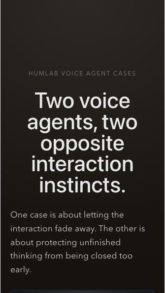

# Humlab Voice Agent Cases



This repository holds two voice agent case studies built as live prototypes:

- `Good Night` — a voice experience for letting go before sleep
- `Interview Facilitator` — a pause-aware voice agent for thinking-in-progress before an interview

Both cases explore a similar question from opposite directions: not how AI can say more, but how voice agents can shape rhythm, attention, and the structure of interaction.

## Why These Two Cases Together

These two projects belong together because they test the same design question under opposite conditions.

- `Good Night` asks how a voice agent can help a person leave interaction.
- `Interview Facilitator` asks how a voice agent can stay present without taking over unfinished thinking.

One case is about withdrawal. The other is about restraint.

Together they make a broader argument: voice UX is not only about what an AI says. It is also about timing, silence, pacing, and whether the system knows when to reduce itself.

## Cases

### Good Night

Good Night is a time-based Voice UX prototype exploring how a voice experience can help someone disengage from their phone before sleep.

It is not designed as a general-purpose chatbot. The interaction is intentionally quiet: one tap to begin, a low-stimulation screen, a short voice presence, and a gradual fade toward silence.

Core idea:

- Many bedtime products add more content, more prompts, and more engagement.
- Good Night tests the opposite direction.
- The design question is not only what the AI should say, but when the AI is no longer needed to speak.

Session arc:

`Arrival -> Unloading -> Slowing -> Fading -> Exit`

Current implementation:

- Persona selection for Mark, Alice, and Marian
- Recorded voice demos
- Live Realtime voice mode
- Final 30-second audio fade
- Case notes panel describing design intent

Prompt and voice notes for Good Night live testing are in [docs/realtime-playground-prompts.md](docs/realtime-playground-prompts.md).

### Interview Facilitator

Interview Facilitator is a pause-aware voice agent prototype for interview preparation.

It is not meant to be a fast answer engine or an AI interviewer that takes over the conversation. Its role is to help the user think through an interview direction while they are still forming what they want to learn.

Core idea:

- Treat hesitation, restarts, and silence as part of thinking.
- Avoid closing uncertainty too early with structure.
- Use short, non-leading questions to help the user name what the interview is really trying to understand.

Interaction arc:

`Warm-up -> Goal -> Recent Example -> Probe -> Synthesis`

Current implementation:

- A dedicated `Interview Facilitator Lab` page
- Session brief input for defining the interview topic
- Draft question-direction output
- Live Realtime facilitator mode with a separate prompt path from Good Night

## Public Site

The static portfolio version of this repo is designed to be published on GitHub Pages:

[https://liujj0907-max.github.io/good-night-voice-experience/](https://liujj0907-max.github.io/good-night-voice-experience/)

The public site is meant to showcase the two cases, their structure, and the recorded demos.

Live Realtime voice mode is intentionally kept as a local-only feature because it depends on a small local server, an OpenAI API key, and proxy/network setup for the Realtime API.

## Realtime Setup

This repo uses a small local server in [server.mjs](server.mjs) so the OpenAI API key stays outside the browser.

Create a local env file:

```bash
cp .env.example .env.local
```

Then set:

```bash
OPENAI_API_KEY=sk-your-api-key-here
REALTIME_VOICE=cedar
```

This file is ignored by git.

## Run Locally

```bash
npm install
npm run dev
```

The local app runs at:

`http://127.0.0.1:5173/`

## Build

```bash
npm run build
```

## Deploy

This repo includes a GitHub Pages workflow that builds the Vite app and publishes the static site on pushes to `main`.

If GitHub Pages has not been enabled yet for the repository, set:

- `Settings -> Pages -> Source`
- `GitHub Actions`
